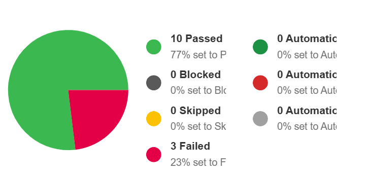

# 🛒 Amazon Login – Manual Testing Project

This project covers the complete **manual testing process** for the Amazon Login functionality.  
It includes **test case design**, **test execution via TestRail**, **defect reporting via Jira**,  
and supporting screenshots/evidence.

---

## 📁 Project Artifacts

This folder contains all test-related deliverables:

- **Test Cases** (Excel Sheet)
- **TestRail Execution Report** (PDF)
- **Jira Bug Reports** (Markdown)
- **Screenshots** (Test Execution & Bug List)
- **Summary / Documentation**

All artifacts follow standard QA documentation practices.

---

## 🧪 Test Artifacts Overview

### ✔ Test Cases  
Detailed manual test cases with:
- Preconditions  
- Test Steps  
- Test Data  
- Expected Result  
- Actual Result  
- Pass/Fail Status  

Available in:  
`test-cases/`

---

### ✔ Test Execution Report (TestRail)  
Executed in TestRail with:
- 13 test cases  
- Passed: 10  
- Failed: 3  
- Pass Rate: 77%  

PDF available in:  
`test-execution/`

---

### ✔ Jira Bug Reports  
All failed test cases were logged in Jira with:
- Summary  
- Steps to Reproduce  
- Expected vs Actual  
- Severity & Priority  
- Evidence  

File available in:  
`bug-reports/`

---

## 📸 Screenshots

### 🔹 TestRail Execution Summary

### 🔹 Jira Bug List

---

## 📌 Project Purpose

This project demonstrates a complete manual QA workflow:
- Test planning  
- Test case design  
- Requirement analysis  
- Test execution  
- Defect identification  
- Defect reporting  
- Documentation & evidence collection  

It is part of the **SQA Portfolio** for showcasing professional testing skills.

---

## 👤 Author  
**Md. Jahidul Islam**  
SQA (Manual & Automation) Enthusiast  
GitHub: https://github.com/Jahidultr
